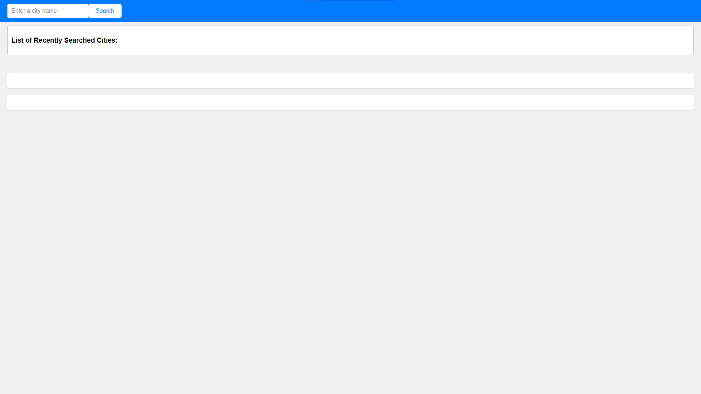
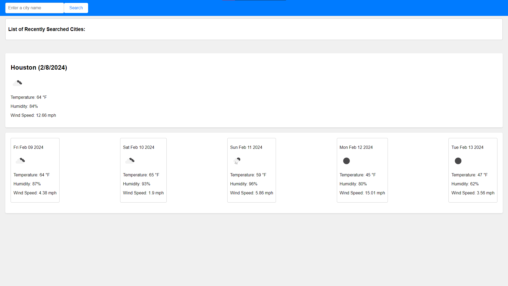

# Weather Report!

#### This Week's Bootcamp Even-Number Challenge: 
Our assignment for Week Six is to create a five day weather forecast using Server-Sided API's.

## Link To Website
[Click here to be re-directed!](https://callbeyond.github.io/weather-report/)

## Usage
Use the search bar to look up any city, even after refreshing and returning back to the page your search history is saved!  

## Screenshots

## Credits

UofM-VIRT-FSF-PT-10-2023-U-LOLC-ENTG
## License

[MIT](https://choosealicense.com/licenses/mit/)
